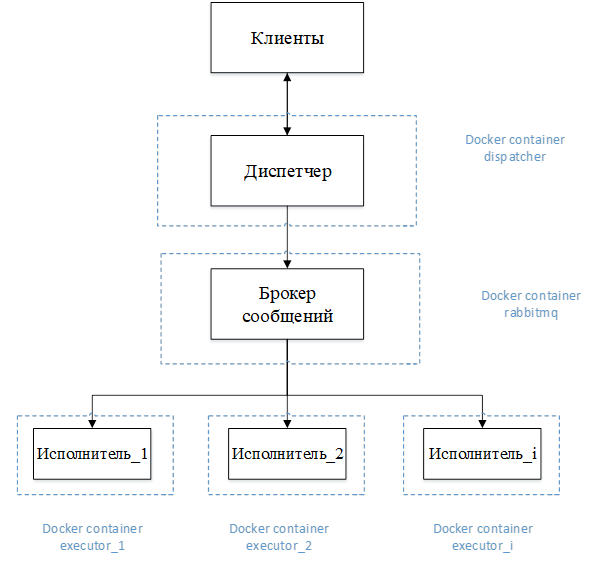

# Dispatcher
### Схема работы сервиса

Все исполнители также могут быть запущены в одном контейнере.

В качестве брокера сообщений был выбран RabbitMQ. Тип Exchange - Direct.
Также выполнена реализация с брокером Kafka.

**Dispatcher Dockerfile :**

FROM openjdk:8-jdk-alpine

EXPOSE 8080  
ADD target/application.properties application.properties  
ADD target/dispatcher.jar dispatcher.jar  
ENTRYPOINT ["java","-jar","dispatcher.jar"]

**Link dockerhub** :  docker push denisdugin/dispatcher:2

RabbitMQ

**Link dockerhub** :  docker push denisdugin/myrabbitmq:latest

**Dispatcher API** : 

POST /api/dispatcher
consumes = APPLICATION_XML_VALUE
